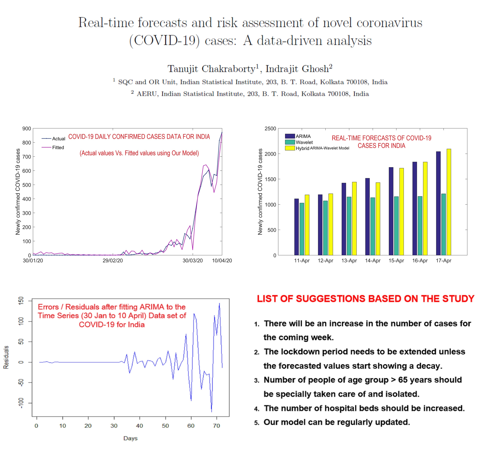
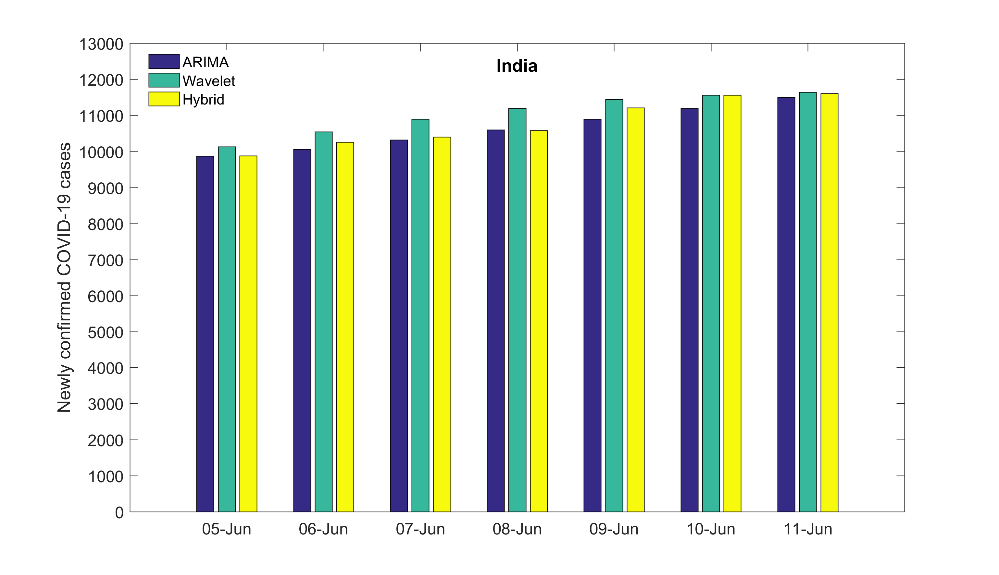
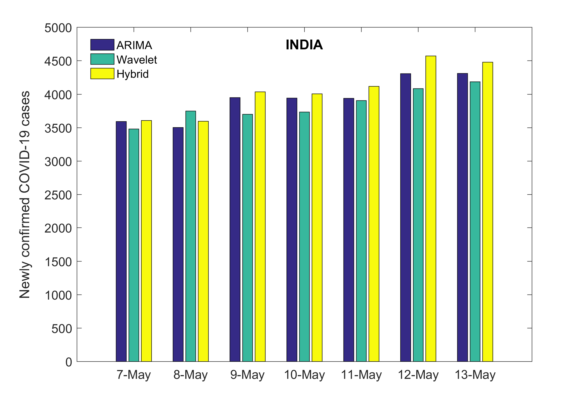
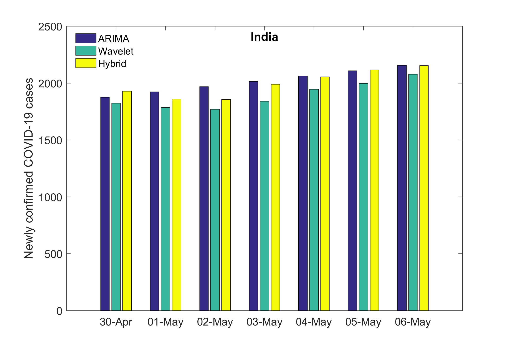
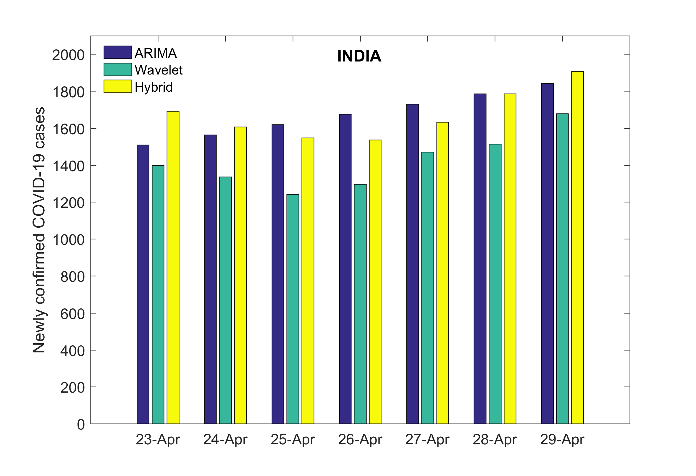
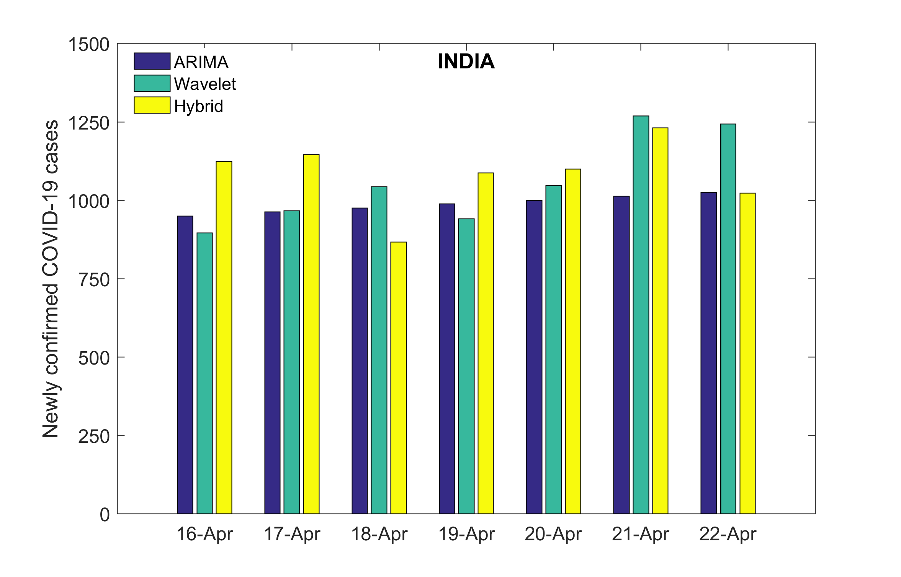

# Real-time forecasts of confirmed COVID-19 cases in India
Codes and datasets for COVID-19 real time forecasts and risk assessment.
Title: Real-time forecasts and risk assessment of novel coronavirus (COVID-19) cases: A data-driven analysis.
Authors: Tanujit Chakraborty, Indrajit Ghosh.
To read the paper, click on this download Link: https://lnkd.in/f28bmJ9

We considered two alarmingly important problems relevant to ongoing COVID-19 pandemic :
1. Real-time forecasts of COVID-19 cases possible?
2. What are the critical risk factors of CFR due to COVID-19?

Here we present a summary of our work and an updated forecast for India (11 April - 17 April, 2020):

Updated forecast for India (12 June - 18 June, 2020)

Updated forecast for India (5 June - 11 June, 2020)

Updated forecast for India (7 May - 13 May, 2020)

Updated forecast for India (30 April - 06 May, 2020)

Updated forecast for India (23 April - 29 April, 2020)

Updated forecast for India (16 April - 22 April, 2020)

The data is obtained from the following website: https://www.covid19india.org/
